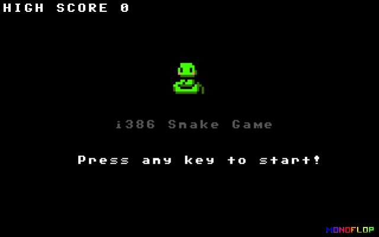
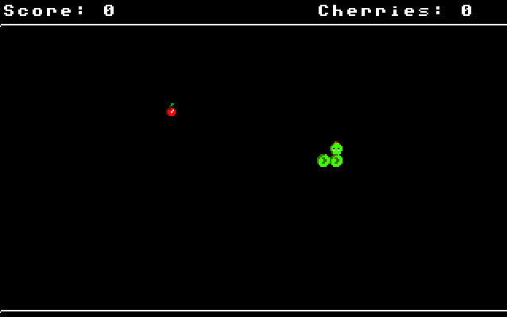

# SnakeOS
SnakeOS is a simple standalone multiboot "kernel" game developed for the i386 architecture, written in c and assembly. (WIP)





## About
Here you can see one of my first steps in the OS-Dev area. I am no expert in C, so be warned :) Many thanks to [osdev.org](https://wiki.osdev.org/Main_Page) and [lowlevel.eu](http://www.lowlevel.eu/wiki/Lowlevel:Portal) for their huge amount of information and tutorials.

## Features
+ Multiboot compatible kernel
+ VGA Mode 13h (320x200x256)
+ Double buffering
+ Protected Mode BIOS calls
+ PIT timing
+ Keyboard support
+ COM logging

## Things to do
+ Propper memory management
+ Sound (BIOS-Beeper)
+ Code improvements

## Build
#### Prerequisites
```
# Debian
sudo apt-get install make gcc nasm
```
#### Build multiboot kernel
```
./build.sh
```

#### Build floppy image
The kernel is packed into a bootable floppy image with grub preinstalled.
```
./build.sh
./generate_image.sh
```

## Run
Since the 'kernel' is multiboot compatible, it can be booted directly from grub. Alternatively, the floppy image can be booted from qemu, virtualbox or similar.

#### Qemu
```
./run.sh
```


License
-------
```
Copyright 2019 Philipp Kutsch

Licensed under the Apache License, Version 2.0 (the "License");
you may not use this file except in compliance with the License.
You may obtain a copy of the License at

    http://www.apache.org/licenses/LICENSE-2.0

Unless required by applicable law or agreed to in writing, software
distributed under the License is distributed on an "AS IS" BASIS,
WITHOUT WARRANTIES OR CONDITIONS OF ANY KIND, either express or implied.
See the License for the specific language governing permissions and
limitations under the License.
```
